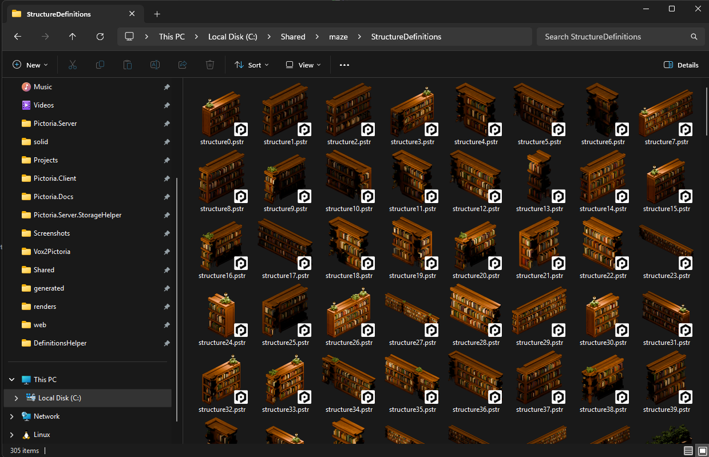
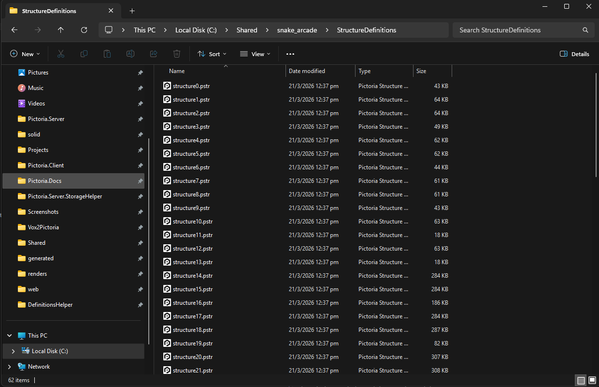

# DefinitionsHelper

Adds thumbnail previews and file type icons for [Pictoria](https://pictoria.world) definition files (`.pstr` and `.ppty`) in Windows Explorer.

Thumbnails (medium/large/extra large icons view):



File type icons (details/list view):



## Quick Start

1. Download the latest `.msi` installer from the [Releases](https://github.com/PictoriaWorld/DefinitionsHelper/releases) page.

2. Run the installer.

3. Open Windows Explorer and navigate to a folder containing `.pstr` files. Switch to medium, large, or extra large icons view to see the thumbnails.

## Overview

### What is Pictoria?
Pictoria is a web-based, isometric social MMO.

Users buy properties (plots of land) and build structures on them.

Structures can be sized and positioned, as well as textured using uploaded 2D images.

### What are .pstr and .ppty files?
`.pstr` (structure definition) and `.ppty` (property definition) files contain information defining structures and properties.

They are used to import and export structures and properties from Pictoria.

When exported (downloaded) from Pictoria, these files appear as generic files in Windows Explorer.

DefinitionsHelper fixes this by:

- **`.pstr` files**: Displaying the structure's first frame as the thumbnail in Windows Explorer, with a Pictoria logo overlay. If the structure has no frames, just the Pictoria logo is displayed.
- **`.pstr` and `.ppty` files**: Displaying the Pictoria logo as the file type icon (displayed when using Windows Explorer details/list view modes).

## Uninstallation

Uninstall via *Settings > Apps > Installed apps > Definitions Helper > Uninstall*. The installer cleanly removes all files and registry entries.

## Development

This is for advanced users who want to build or modify DefinitionsHelper.

### How it works
DefinitionsHelper is a COM DLL that implements Windows' `IThumbnailProvider` interface. When Windows Explorer needs to display a thumbnail for a `.pstr` file, it loads the DLL, which extracts the first-frame PNG from the archive and returns it as a bitmap.

The DLL is compiled with NativeAOT, so it has no .NET runtime dependency - it loads directly into Windows Explorer's process like any native DLL.

### Requirements
- [.NET 9 SDK](https://dotnet.microsoft.com/en-us/download/dotnet/9.0) or later
- [Visual Studio](https://visualstudio.microsoft.com/) with the *Desktop development with C++* workload (for the NativeAOT linker)

### Building

```
dotnet build
```

### Testing

```
dotnet test
```

### Publishing (NativeAOT)

Publishing requires the MSVC linker. From a Developer Command Prompt for Visual Studio:

```
dotnet publish src/DefinitionsHelper -c Release -r win-x64 -p:IlcUseEnvironmentalTools=true
```

The output is at `src/DefinitionsHelper/bin/Release/net9.0-windows/win-x64/publish/`.

Copy `assets/pictoria_structure.ico` next to the published DLL before registering.

### Manual Registration

Register (elevated command prompt):
```
regsvr32 path\to\DefinitionsHelper.dll
```

Unregister:
```
regsvr32 /u path\to\DefinitionsHelper.dll
```

### Project Structure

```
src/DefinitionsHelper/
├── com/
│   ├── ComGuids.cs                 # GUID constants for COM interfaces and the handler
│   ├── ComInterfaces.cs            # IThumbnailProvider, IInitializeWithStream, IStream, IClassFactory
│   ├── DllExports.cs               # DllGetClassObject, DllCanUnloadNow, DllRegisterServer, DllUnregisterServer
│   ├── ModulePath.cs               # Resolves DLL and icon paths
│   ├── PstrClassFactory.cs         # IClassFactory that creates PstrThumbnailProvider instances
│   └── PstrThumbnailProvider.cs    # Reads the file stream, extracts the PNG, returns a bitmap to Windows Explorer
├── extraction/
│   └── PstrImageExtractor.cs       # Gzip decompression and lenient tar parsing to find the first-frame PNG
└── imaging/
    └── BitmapService.cs            # PNG-to-bitmap conversion via GDI+ with optional logo overlay

tests/DefinitionsHelper.Tests/
├── PstrImageExtractorTests.cs      # Extraction tests with real .pstr fixtures
└── fixtures/
    ├── cuboid.pstr                 # Valid structure definition
    └── invalid.pstr                # Invalid file for error handling tests

installer/DefinitionsHelper.Installer/
├── Package.wxs                     # WiX v5 MSI definition
└── DefinitionsHelper.Installer.wixproj
```

## License

[MIT](LICENSE)

"Pictoria" and the Pictoria logo are trademarks of Pictoria and are not licensed under this license.
